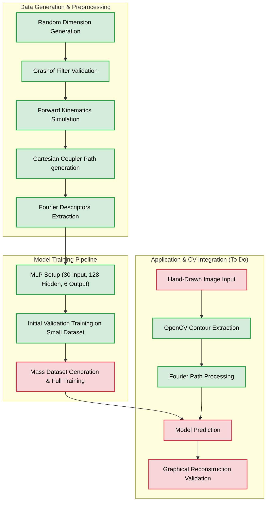

# Automated Design of Four Bar Linkage from Hand-Drawn Approximate Coupler Trajectory Using Data-Driven Methods

## 1. Introduction

Designing a planar four-bar linkage to track a specific path is a classic challenge in mechanical engineering. Traditionally, this is achieved through complicated graphical or analytical methods which have limited accuracy. However, with deep learning, it's now feasible to generate mechanical geometries directly from desired output paths. This project connects machine learning and mechanical design to build a system that can automatically calculate the dimensions of a four-bar linkage based entirely on a simple hand-drawn spatial trajectory. The intent of enabling hand-drawn path input is to allow designers the flexibility to ideate and get quick results, which can be extended to full design methodologies that enable physical linkage design.

## 2. Aim and Objective

To construct a deep learning model capable of designing a complete mathematical four-bar linkage that can approximate and follow a desired hand-drawn user path.

**Objectives:**
- To programmatically define the forward kinematics of a standard four-bar linkage.
- To generate a valid synthetic dataset of linkage dimensions and their resulting coupler path shapes.
- To design and train a supervised neural network that accurately maps continuous output paths back to their originating physical linkage parameters.

## 3. Methodology

Instead of tackling absolute lengths, the model outputs normalized length ratios to avoid getting confused by overlapping scaled solutions.

### 3.1 Dimensional Normalization
The core link lengths ($a, b, c, d$), alongside the coupler offset dimensions, are all presented as ratios relative to the longest link in the assembly. This guarantees the model learns scale-invariant geometric relationships.

### 3.2 Synthetic Data Generation Pipeline
A forward kinematics script is used to algorithmically produce data. Random linkages are generated but then strictly filtered through Grashof's condition. This ensures that only functional, continuous mechanisms (which don't physically lock up) survive. The $(X, Y)$ coordinate sequence of the resultant coupler path is computed analytically.

### 3.3 Fourier Extraction
Since giving raw coordinates as input to the model would be inefficient, the path is converted to the frequency spectrum. The $(X,Y)$ sequence is passed into a Fourier transform, and the lowest 15 complex Fourier Descriptors are flattened into a concise 30-element feature vector. This acts as clean input data for the model.

### 3.4 Neural Network Architecture
The main architecture is a Multi-Layer Perceptron (MLP) built in PyTorch. It takes the 30 Fourier Descriptor variables as input. From there, it flows through three hidden layers, each having 128 nodes with ReLU activations. Ultimately, the network outputs 6 numerical node values which correspond to the relative parameters needed to construct the final predicted linkage.

## 4. Current Architecture & Status

At this stage in the project, the foundational code is set up, and we've successfully validated both the data generation pipeline and the overall model training layout using a small preliminary dataset.

*(Green = Validated & Completed Work, Red = Pending Future Tasks)*

## 5. References

1. B. Röder, S. Hajipour, H. Ebel, P. Eberhard, and D. Bestle, “Automated design of a four-bar mechanism starting from hand drawings of desired coupler trajectories and velocity profiles,” *Mechanics Based Design of Structures and Machines*, 2025.
2. C. M. Bishop, *Pattern Recognition and Machine Learning* (Information Science and Statistics). Berlin, Heidelberg: Springer-Verlag, 2006.
3. L. Herrmann, M. Jokeit, O. Weeger, and S. Kollmannsberger, *Deep Learning in Computational Mechanics: An Introductory Course*. Cham, Switzerland: Springer Nature Switzerland AG, 2025.
